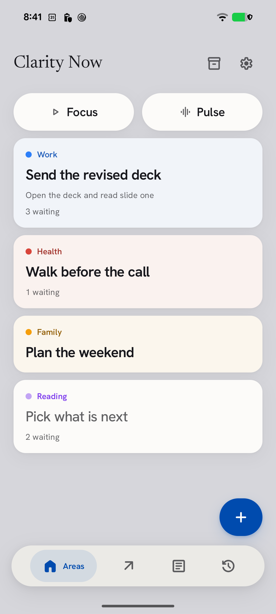
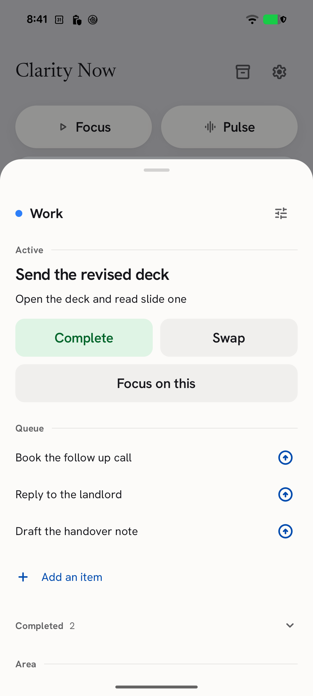
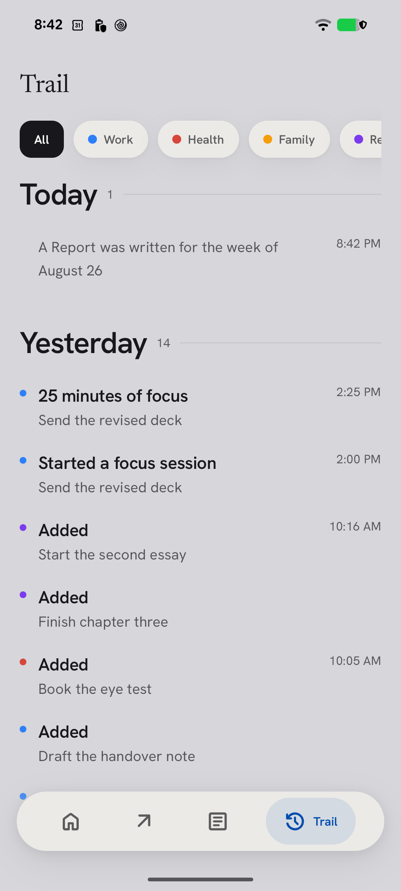
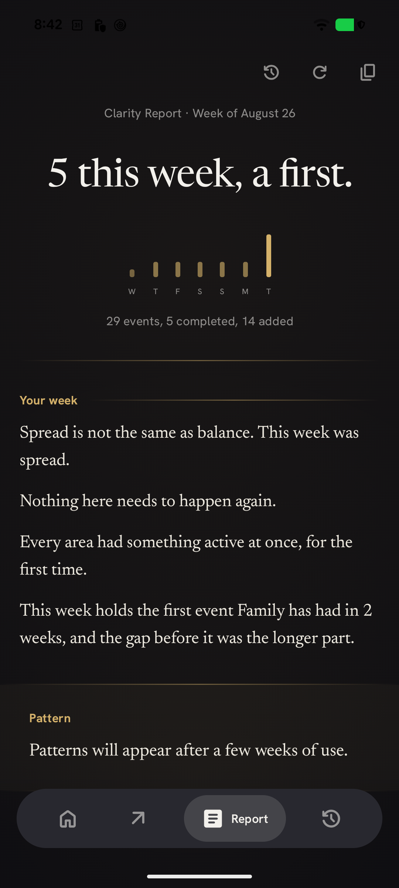
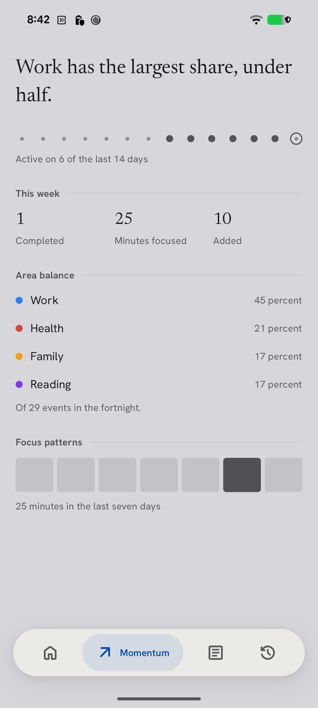

# Clarity Now

**Most task apps hand you a list of forty things and ask you to pick. Picking is the hard
part.**

Clarity Now gives each area of your life one active item. Everything else waits in a queue
behind it. You only ever see what is next.

Free, open source, and offline by construction: the app has no `INTERNET` permission at
all, which is a fact your phone enforces rather than a promise this file makes.

Built by Kamsiob.

<p align="center">
  
  
  
</p>

<p align="center">
  <em>Left: one active thing per area, and how much is waiting behind it.
  Middle: open an area to see its queue and make any of it active in one tap.
  Right: everything you have done, back to the day you installed it.</em>
</p>

---

## Why it works this way

**Prioritizing is the expensive step, so the app does it once and then holds the result.**
An area is a part of your life you want to keep track of. Each one holds exactly one
active item, and the rest of that area's work sits in a queue you do not have to look at.
Finishing the active item promotes the next one. There is no screen in this app that shows
you forty things.

**Nothing here can break.** No streaks, no scores, no badges, no completion percentage.
Leaving for a month costs nothing, and when you come back the app says so and offers to
put your active items back in their queues so you can choose again. It never counts the
days you were away back to you.

**Everything the app says about you comes from your own log, and it never invents.** The
Pulse, the weekly Report and the Momentum screen are written by a deterministic engine
over your own events, using a corpus of hand written sentences. There is no model on the
device and no call to one anywhere else. A sentence that cannot be substantiated against
the log is not shown.

<p align="center">
  
  
</p>

<p align="center">
  <em>Left: a page about your week, written on your phone every Sunday.
  Right: what you actually did, counted. Nothing scored.</em>
</p>

---

## What is in it

- **Areas and queues.** One active item each. Swipe right to complete, left to swap. Open
  an area to see the queue and promote anything in it in one tap.
- **Focus sessions.** One item on a timer with nothing else on the screen. Add time
  without stopping. End early whenever you want: a six minute session is recorded as six
  minutes of focus and the app does not comment on it.
- **The Pulse.** One observation and one question a day, answered with one tap. Turn it
  off in Settings.
- **The Clarity Report.** A page about your week, written on your device every Sunday.
- **The Trail.** Every event, back to the day you installed the app. It is the source of
  truth; areas and items are a cache that can be rebuilt from it at any time.
- **Six home screen widgets**, three shortcuts and a quick settings tile, so the app does
  not have to be opened to be useful.
- **An unfiled inbox** for writing something down without deciding where it goes.
- **Backup you own.** Export the whole log to a file, encrypted with a password or not,
  and import it back on any device.
- **Adjustable text size** on top of the phone's own, and a **calm mode** that takes the
  color and the motion down without taking the meaning out.

---

## Privacy

These are checkable facts, and most of them fail the build if they stop being true.

- **No `INTERNET` permission**, checked on every build against the *merged* manifest
  rather than the source. Android will refuse any attempt this app makes to open a
  connection, and you can verify it yourself in the app info screen.
- **No account, no cloud, no server.** There is nowhere for your data to go.
- **No analytics, no telemetry, no crash reporting, no advertising, no third party SDKs.**
- **No AI and no machine learning**, not one library and not one call.
- **No subscription, no in-app purchase, no locked feature, no upgrade prompt.** The only
  money related element in the app is one link to Buy Me a Coffee, on two screens, that
  you never have to press.

Your areas, items, history, reflections and reports live in one database inside this app's
private storage. `Erase all data` in Settings removes all of it permanently, and so does
uninstalling.

---

## Building it

Requires JDK 21 and the Android SDK. The Android Gradle Plugin does not support JDK 26, so
set `JAVA_HOME` before every Gradle invocation.

```bash
export JAVA_HOME=/path/to/jdk-21

./gradlew verifyClarity          # every automated gate that runs offline
./gradlew :app:testDebugUnitTest # the unit suite on its own
./gradlew :app:installDebug      # build and install on a connected device
./gradlew :app:lintDebug         # Android Lint, against app/lint-baseline.xml
```

`verifyClarity` runs four things and all four have to stay green:

- **`verifyLanguageHygiene`** fails on an em dash, an en dash, any character above
  `U+007F`, or a British spelling, across every `.kt`, `.kts`, `.xml`, `.md` and `.pro`
  file in the repository.
- **`verifyNoInternetPermission`** fails if any variant's merged manifest declares a
  network permission.
- **The unit suite**, including the replay harness and a golden fixture, currently 1,089
  tests.
- **Android Lint**, with `warningsAsErrors` and a recorded baseline.

Regenerating the golden fixture is deliberate and never a side effect of a test run:

```bash
./gradlew :app:testDebugUnitTest -PregenerateGolden=true
```

Content edge case fixtures for device testing, which write importable backup files for
one area, twelve areas, a forty item queue, very long strings and an idle area:

```bash
./gradlew :app:testDebugUnitTest --tests '*EdgeCaseFixtures*' -PwriteFixtures=true
```

---

## How the code is laid out

`docs/ARCHITECTURE.md` has the full map. The three things that surprise people:

- **`ClarityEvent` is plain Kotlin and `ClarityEventRow` is the Room entity.** The reducer
  must not import `androidx.room`, so the log record and the database row are separate
  types with mappers between them.
- **`ClarityRepository` is the only writer.** View models never touch a DAO, composables
  never touch a repository. One write path: build the event, assign lamport and originId,
  then append and project inside one transaction.
- **The in-memory `ClarityState` is the projection everything reads.** The Room cache
  tables exist for cold start speed and paging and can be dropped and rebuilt from the log
  at any time. A debug action does exactly that as a proof.

`domain.engine`, `domain.guidance`, `domain.query`, `domain.replay` and `domain.corpus`
are pure Kotlin: no Android imports, no `System.currentTimeMillis`, no `Random`, no
`String.hashCode()`. `DomainPurityTest` scans all five.

---

## Documents

| file | authority over |
|---|---|
| `MASTER_BUILD_PROMPT.md` | behavior, data, build order |
| `design-v3.md` | everything visual and interactive |
| `CLARITY_LOGIC_ENGINE.md` | all six engine layers, including guidance |
| `CORPUS_1_PULSE.md` | Pulse language |
| `CORPUS_2_REPORT.md` | Report language and the guidance corpus |
| `CORPUS_3_MOMENTUM.md` | Momentum headline and Areas banner language |
| `docs/VISUAL_DIRECTION.md` | the visual refresh, its diagnosis and its amendments |
| `docs/COMPONENT_AND_LAYOUT.md` | the control, container and layout systems |
| `docs/MOTION_AND_STANDARDS.md` | motion taxonomy, tokens and enforcement |
| `docs/ONBOARDING_VARIANTS.md` | three tone variants and why one shipped |
| `DECISIONS.md` | why the project is the way it is |
| `HANDOFF.md` | what only the owner can do |

---

## License

AGPL-3.0. See `LICENSE`.

---

Clarity Now is a productivity tool. It does not provide medical advice, diagnosis or
treatment.
